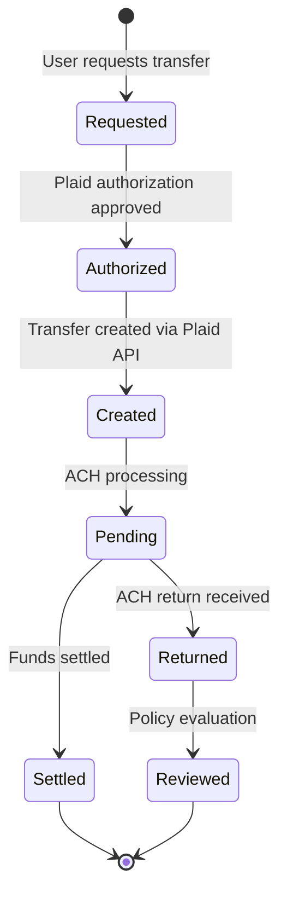

# Funds Flow Diagrams — Plaid Transfer

## Platform Flow (Aspire)

## Transfer Lifecycle

## Key Rules
- Always call Plaid `authorization` endpoint before `create` — deny/escalate on declined authorization (Law #3).
- Log both authorization and create steps with receipts linked by `trace_id` (Law #2).
- Finn (Money Desk) executes via capability token — never decides autonomously (Law #7).
- All transfer operations are RED tier — require explicit authority + approval (Law #4).
- Payment state machine (`backend/orchestrator/services/state_machines/payment.py`) governs the lifecycle.
- Dual-approval required for amounts >$10K — same-approver bypass is blocked.
