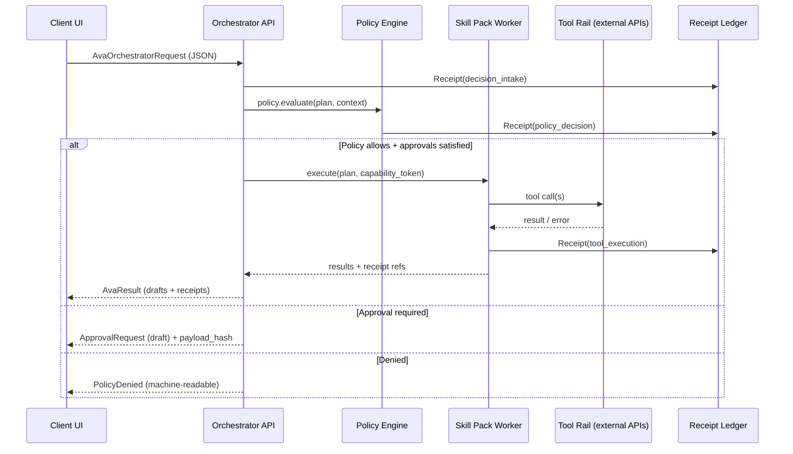

# Architecture and Flow

**Source:** Ava User Enterprise Handoff v1.1

## Service boundaries (minimum)
- **Client UI (Desktop/Mobile/Web):** renders drafts, requests approvals, never executes tools.
- **Orchestrator API:** validates requests, creates plan, routes to Skill Packs.
- **Policy Engine:** evaluates allowlists, risk tiers, approvals, presence, and capability tokens.
- **Execution Workers (Skill Packs):** perform allowed tool calls; cannot override policy.
- **Receipts Ledger:** append-only event log for decisions, approvals, executions, and research.

## Core request flow (sequence)

## Fail-closed error codes
- `SCHEMA_VALIDATION_FAILED` — Any schema mismatch
- `APPROVAL_REQUIRED` — Any missing approval
- `CAPABILITY_TOKEN_REQUIRED` — Any missing/expired capability token for execution
- `TENANT_ISOLATION_VIOLATION` — Any tenant boundary mismatch

## Risk tier model
Use **green/yellow/red** (not "low/medium/high"). Red-tier requires presence proof.

## Cross-reference
- AvaOrchestratorRequest: `plan/contracts/ava-user/ava_orchestrator_request.schema.json`
- AvaResult: `plan/contracts/ava-user/ava_result.schema.json`
- Policy engine: `plan/specs/ava-user/policy_engine_spec.md`
- Error codes adopted as starting taxonomy for Phase 1
